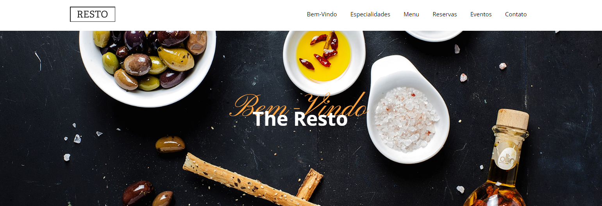
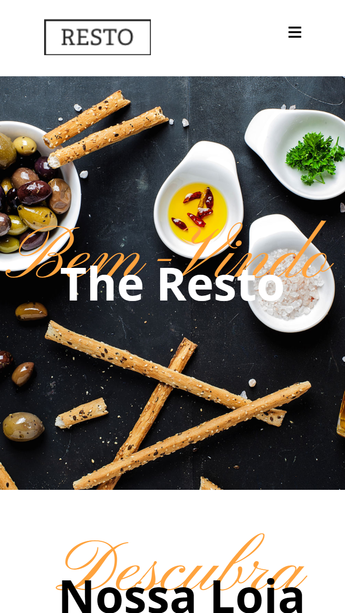
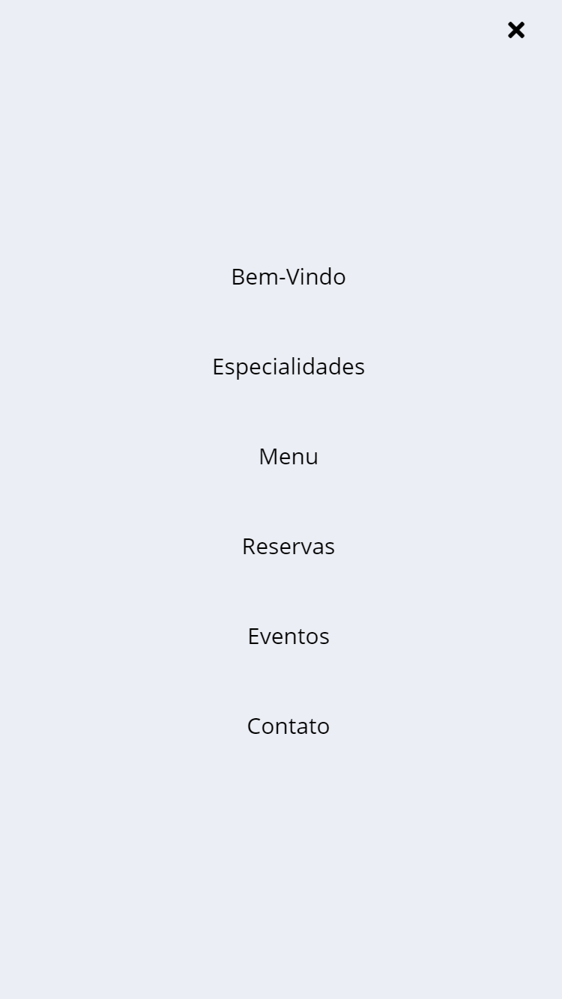
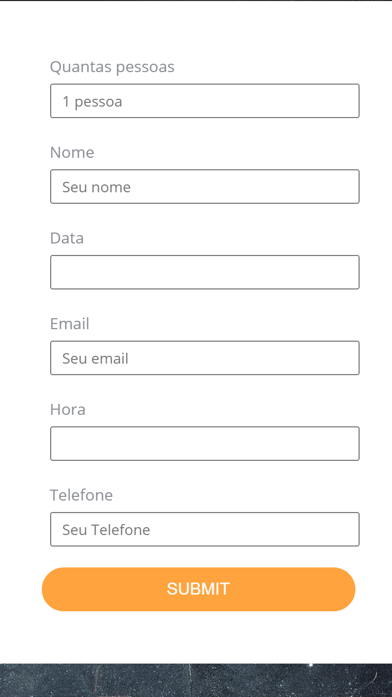

# Resto
<h1 align="center">
  
</h1>
<h4 align="center"> 
	🚧  Resto 🚀 Concluído  🚧
</h4>

## Sobre o projeto

Site de restaurante Resto.

##  Telas

- [x] Home

## Web
<h1 align="left">
  
    </h1>

## Mobile

<h1 align="left">
    
    
  
    </h1>
  
## Tecnologias
 
- [HTML5](https://www.w3schools.com/html/default.asp)
- [CSS3](https://www.w3schools.com/w3css/w3css_cards.asp)
- [Javascript](https://www.w3schools.com/js/default.asp)

## Licença
Este projeto pode ser usado por qualquer pessoa! Licença MIT

